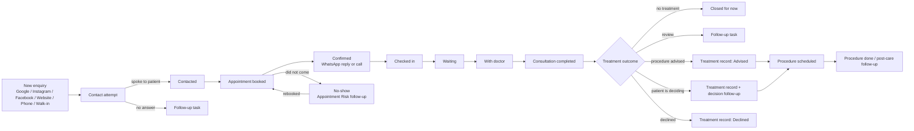
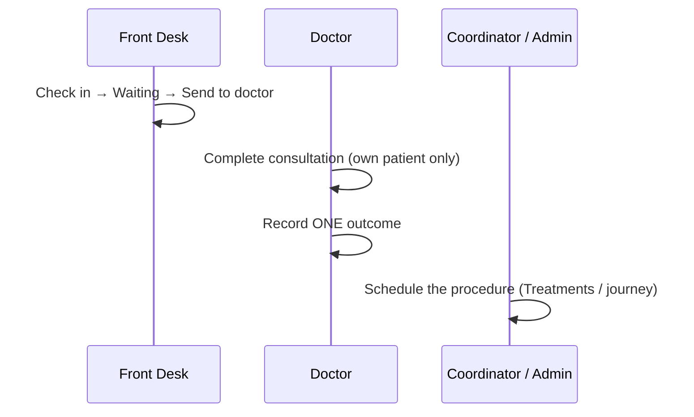

# The Namokar patient path

One enquiry is one **Journey**. One person is one **Patient** (found by phone number) and can have several Journeys (e.g. Cataract and Oculoplasty).

## Two different things on screen

* **Stage** (stored, five-step path): Enquiry → Contacted → Appointment → Attended → Consulted → Treatment advised → Scheduled → Completed, or **Lost**. Only PulseOS moves it.
* **Where the patient is right now** (the badge): *Appointment booked / confirmed, Checked in, Waiting, With doctor, Consultation completed, Treatment follow-up, Procedure scheduled, Procedure done, No-show, Cancelled, Closed*. It is **derived** from the visit, the treatment and the open tasks, never stored, so it can never disagree with them.

Precedence when several things are true (first match wins): Closed → in the clinic (With doctor > Waiting > Checked in) → Procedure done / scheduled → Appointment booked / confirmed → Treatment follow-up → the most recent closed visit (Consultation completed / No-show / Cancelled).

## WhatsApp: when it is sent

* **Booked** (the visit exists) sends nothing. **Confirmed** (the patient agreed, on the phone or by reply) creates exactly one *Appointment Confirmation* and a *1 hour before* reminder (the Namokar setting; an Admin can change it under Settings → Reminders).
* No reminder is created if its time has already passed. **Reschedule** cancels the pending reminder; the visit is *Booked* again until it is re-confirmed. **Cancel**, **No-show** and **Complete** cancel pending reminders. Repeating *Confirm* never sends twice.
* WhatsApp Notifications work with the WhatsApp Inbox switched off. If the provider is not set up or fails, the visit stays booked/confirmed and the message shows *Blocked* / *Failed* with the reason.

## Who moves the patient

## Treatment outcome (operational, not clinical)

| Outcome | What PulseOS does |
|---|---|
| No treatment needed | Nothing further. |
| Review / follow-up | One follow-up task (an existing open one is reused). |
| Surgery / procedure advised | A treatment record *Advised* (reused if the same procedure is already open). |
| Patient is deciding | The treatment record *Decision pending* **and** one treatment-decision follow-up. |
| Patient declined | The open treatment record is *Declined*; no task is invented; the journey is not closed. |
| *Procedure scheduled* | Not an outcome: it goes through the existing surgery scheduling (date, doctor, branch). |

## No-show

Marked by Front Desk / Coordinator with a reason → exactly **one** *Appointment Risk* follow-up for the journey's Assigned Team Member (a repeat click or a second no-show never doubles it) → it appears in **My Work** → the lead shows *No-show* and is listed under **Leads → Missed Visit** until a new visit is booked.

## Duplicates and original source

* The same phone number — however it is written (`98…`, `+91 98…`, `098…`) — is the same Patient. A new service enquiry creates a new Journey on that Patient.
* **Original source** is written when the Journey is created and is never overwritten by a later contact (a website form from a known patient adds to the open Journey).

## Exports
The Excel report uses the same words as the screens: the person looking after a patient is the **Team Member** (journeys) / **Assigned Team Member** (follow-ups), and *By team member* is the workload sheet.
